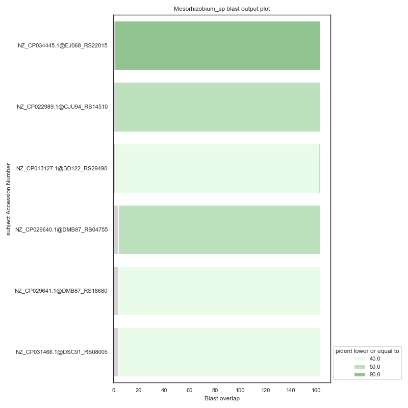
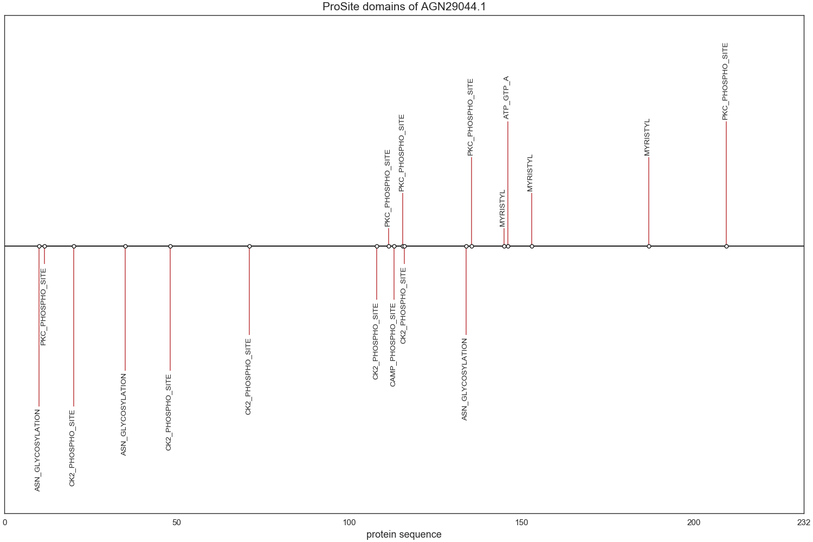

# **_BlastTreeDom_**

#### Given query FASTA file(s) and genBank file(s):
* Parse genBank file(s) CDS protein sequences and info
* Perform blastp analysis
* Compute Neighbour-Joining phylogenetic tree(s) using MUSCLE
* Extract ProSite domains of each of the hit sequences from blastp

#### Required packages
* biopython  
* blast  
* muscle  

## Required package installation

[Conda](https://docs.conda.io/projects/conda/en/latest/user-guide/install/) or [MiniConda](https://docs.conda.io/en/latest/miniconda.html) installation is highly recommended  

The following installation will be performed using conda from the command line  

#### [biopython](https://anaconda.org/anaconda/biopython)  
`conda install -c anaconda biopython`  

#### [blast](https://www.ncbi.nlm.nih.gov/books/NBK279671/)  
* Via [Anaconda](https://anaconda.org/bioconda/blast)  
  `conda install -c bioconda blast`  
  `conda install -c bioconda/label/cf201901 blast`  
* Via [NCBI website](https://www.ncbi.nlm.nih.gov/books/NBK279671/)  

#### [muscle](https://anaconda.org/bioconda/muscle)  
`conda install -c bioconda muscle`  
`conda install -c bioconda/label/cf201901 muscle`  
  
  
## USAGE  

### User-friendly  
After cloning and cd into **_BlasTreeDom_** repository:  
* Run `python main.py -ui` from the command line  

Following steps will be prompted on the Terminal  

### One-shot command  
Run `python main.py [arguments]`  
  
As arguments the following will be expected:  
* A query FASTA file or a directory containing several files:  
  `-query query.fasta`  
  
* Subject sequence againt which to perform the analysis:  
  - A genBank file or directory containing several files from which to parse the CDS protein sequences  
 `-genBank genBank`  
  - Alternatively a multifasta file  
  `-multifasta subject.fasta`  
  
* If no blast analysis is required, unaligned sequences in a FASTA file can be provided  
`-unaligned unaligned.fasta`  

## Output  

Results will be stored in a directory named by date and time of command execution.  
Within this directory the following can be found: a _log_ file, database folder, merged query and subject (extracted from genBnak files) FASTA files, and a separate folder for each input query   

### blast  

* A tsv file containing all results  
* Graphical representation of output:  

  

### Alignment and N-J tree  

* Unaligned and aligned sequences will be stored in each query directory  
* Neighbor-Joining tree computed using MUSCLE  

### ProSite domains  

* A tsv file containing information on: sequence accession number (id) and name, accession, description, pattern, start and end location of found ProSite domains  
* A txt file for each query and hit sequence containing the domains information plus additional text parsed from prosite.doc  
* Graphical representation for each protein sequence:  

  

### Merged results  

* A tsv file containing blast_output, genBank parsed fields and \
extracted ProSite domain names to create an integrated ouput file
